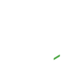

<!--
**erikfritas/erikfritas** is a ✨ _special_ ✨ repository because its `README.md` (this file) appears on your GitHub profile.

Here are some ideas to get you started:

- 🔭 I’m currently working on ...
- 🌱 I’m currently learning ...
- 👯 I’m looking to collaborate on ...
- 🤔 I’m looking for help with ...
- 💬 Ask me about ...
- 📫 How to reach me: ...
- 😄 Pronouns: ...
- ⚡ Fun fact: ...
-->

<h1>Laravel Developer 🍟✨</h1>

  

    <ul>
      <li>Meu nome é <i>Érik 🍟</i>, sou Brasileiro 🇧🇷, tenho 17 anos de idade, possuo experiência com desenvolvimento <strong>frontend 🔭</strong> e <strong>backend 🔭</strong>, atualmente trabalho como <strong>Freelancer Fullstack</strong> na empresa <a href="https://lumaypublicidade.com/">LUMAY Publicidade</a>, ainda assim estou em busca de emprego.</li>
      <li>🔭 Atualmente estou estudando <strong>backend 🌱</strong> com Laravel.</li>
    </ul>
  

  

    
  

  
   
  
  

    
  

  

 

  <kbd>
    <kbd>Front-end</kbd>
     
     
     
     
     
    
    
  </kbd>
  <kbd>
    <kbd>Back-end</kbd>
     
     
    
    
    
    
    
    
    
    
  </kbd>
  <kbd>
    <kbd>Others</kbd>
     
     
    
    
  </kbd>
  <kbd>
    <kbd>Tools</kbd>
     
     
    
    
  </kbd>
  <kbd>
    <kbd>OS</kbd>
     
     
    
  </kbd>

<footer align="center">
  

    -=|. <strong>Se quiser me chamar pra gente fazer um projeto...</strong> .|=- 
    -=|=- 📫 Me chame por aqui: erikfritasgithub@gmail.com -=|=- 
    -=|=------------- ou pelo meu insta: 📷 @erikfritas -------------=|=-  
  
  

   
  

    Número de visitas:   
  

   
  

     <strong>
           <i>“I hope to see Ruby help every programmer in the world to be productive, and to enjoy programming, and to be happy. That is the primary purpose of Ruby language.”</i>
      
    — Yukihiro Matsumoto
     </strong>
  

</footer>

