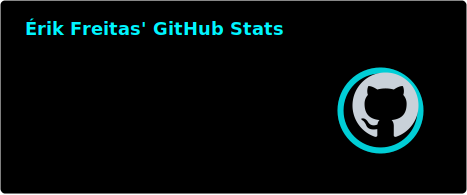
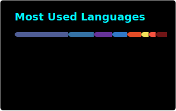

<!--
  ╔══════════════════════════════════════════════════════════════╗
  ║  ÉRIK FREITAS — FUTURISTIC GITHUB PROFILE README           ║
  ║  github.com/erikfritas                                     ║
  ╚══════════════════════════════════════════════════════════════╝
-->


<div align="center">

[](https://git.io/typing-svg)

<br/>

<a href="https://erikfritas.com" target="_blank">
  
</a>
<a href="https://www.instagram.com/erikfritas/" target="_blank">
  
</a>
<a href="mailto:erikfritasgithub@gmail.com">
  
</a>
<a href="https://github.com/erikfritas?tab=followers">
  
</a>

<br/><br/>


</div>

---

## `> SYSTEM.PROFILE`

```ts
const erik = {
  name: "Érik Freitas",
  roles: ["Full-Stack Software Engineer", "Entrepreneur"],
  company: "Apex Dev Solutions",
  location: "Naples, Italy",
  experience: "5+ years",

  mission: [
    "Build fast, scalable and visually remarkable digital products",
    "Transform complex ideas into intuitive user experiences",
    "Combine engineering, product thinking and premium UI/UX",
  ],

  currentFocus: [
    "Next.js and TypeScript applications",
    "Web and mobile product architecture",
    "Automation and AI-powered experiences",
    "Performance, accessibility and developer experience",
  ],
};
```

I design and build **end-to-end digital products**, from the first interface concept to backend architecture, databases, APIs, deployment and continuous improvement.

My work combines **clean engineering**, **product strategy**, **cinematic interface design** and a strong focus on performance. Through **Apex Dev Solutions**, I turn ambitious ideas into production-ready web and mobile experiences.

- 🚀 Building modern products with **Next.js, React, TypeScript and Node.js**
- 📱 Creating cross-platform mobile experiences with **React Native**
- ⚙️ Developing APIs, automations, bots and backend systems
- 🎨 Crafting responsive, accessible and high-impact interfaces
- 🧠 Constantly improving architecture, testing, security and DevOps skills
- 🌐 Explore my work at **[erikfritas.com](https://erikfritas.com)**

---

## `> TECHNOLOGY.ARSENAL`

### Frontend & Interface Engineering

<p align="left">
  
</p>

### Backend & Application Architecture

<p align="left">
  
</p>

### Databases & Data

<p align="left">
  
</p>

### Cloud, DevOps & Delivery

<p align="left">
  
</p>

### Quality, Tooling & Product Design

<p align="left">
  
</p>

> **Core engineering capabilities:** full-stack architecture, REST and GraphQL APIs, authentication and authorization, relational and NoSQL database design, responsive UI, accessibility, performance optimization, automated testing, CI/CD, containerization, cloud deployment, mobile development and technical product delivery.

---

## `> ENGINEERING.PRINCIPLES`

```txt
01. User experience is part of the architecture.
02. Clean code should make future changes easier, not harder.
03. Performance, accessibility and security are product features.
04. Automation should eliminate repetitive work.
05. A great developer understands both technology and business impact.
06. Ship, measure, learn and continuously improve.
```

---

## `> CURRENT.MISSION`

<table>
  <tr>
    <td width="50%" valign="top">
      <h3>⚡ Apex Dev Solutions</h3>
      <p>
        Building high-end digital experiences for businesses and ambitious
        products, with a focus on modern engineering, strong visual identity
        and measurable results.
      </p>
    </td>
    <td width="50%" valign="top">
      <h3>🧬 Futuristic Portfolio</h3>
      <p>
        Creating a cinematic, system-inspired portfolio with Next.js,
        TypeScript, Tailwind CSS, advanced motion, 3D elements and immersive
        interactions.
      </p>
    </td>
  </tr>
</table>

<div align="center">
  <a href="https://erikfritas.com">
    
  </a>
</div>

---

## `> GITHUB.INTELLIGENCE`

<div align="center">




<br/><br/>


<br/><br/>


</div>

> GitHub language cards reflect repository code distribution, not a complete measurement of professional expertise.

---

## `> CONTRIBUTION.SNAKE`

<div align="center">
  <picture>
    <source
      media="(prefers-color-scheme: dark)"
      srcset="./profile/github-contribution-grid-snake-dark.svg"
    />
    <source
      media="(prefers-color-scheme: light)"
      srcset="./profile/github-contribution-grid-snake.svg"
    />
    
  </picture>
</div>

---

## `> COLLABORATION.PROTOCOL`

I am interested in projects involving:

- High-performance web applications and SaaS products
- Premium websites with strong UI/UX and visual storytelling
- Mobile applications and cross-platform experiences
- APIs, integrations, automations and intelligent workflows
- Startup MVPs and products that need to scale
- Open-source projects with meaningful technical challenges

<div align="center">

### Have an ambitious idea?

<a href="mailto:erikfritasgithub@gmail.com">
  
</a>
<a href="https://erikfritas.com">
  
</a>

</div>

---

<div align="center">

```txt
┌────────────────────────────────────────────────────────────┐
│  BUILDING THE FUTURE, ONE COMMIT AT A TIME.                │
└────────────────────────────────────────────────────────────┘
```

<sub>Designed and engineered by <strong>Érik Freitas</strong> · Apex Dev Solutions</sub>

</div>


